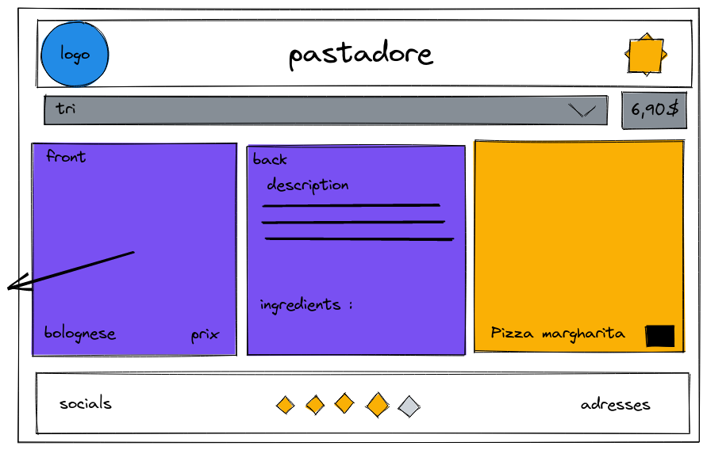
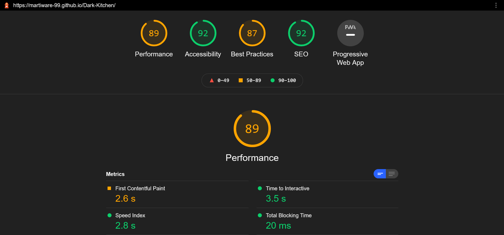

## Description

Création d'une dark kitchen : 
- HTML and CSS
- Responsive design
- Javascript Basics
- The DOM

## Lien

[Github page](https://Martiware-99.github.io/Dark-Kitchen/)

## Rendu

## Perf lighthouse

## to do list
1. panier fonctionel
2. arranger le css
3. créer un bouton "ajouter au panier" a l'arriere de la carte
4. ~~créer un tri fonctionel~~
6. ~~update le js par la suite~~
7. ~~ajouter des plats/boissons~~
8. responsive design
9. ~~liste d ingredients dynamique~~
10. tourner les cartes sur mobile 

