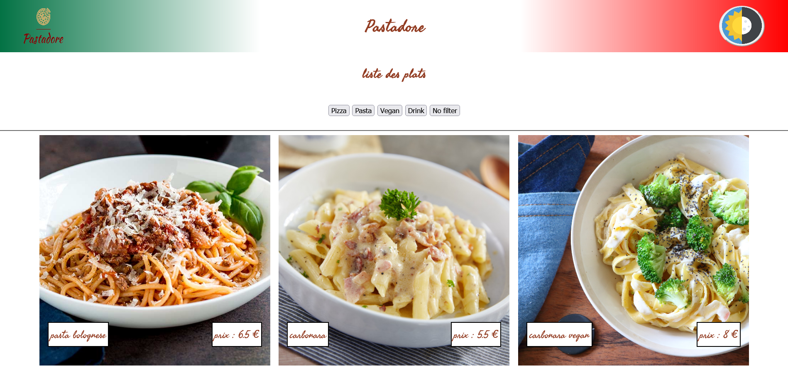

## Description

Création d'une dark kitchen : 
- HTML and CSS
- Responsive design
- Javascript Basics
- The DOM

## Lien

[Github page](https://Martiware-99.github.io/Dark-Kitchen/)

## Rendu

## Perf lighthouse

## to do list
-panier fonctionel
-arranger le css
-créer un bouton "ajouter au panier" a l'arriere de la carte
-créer un tri fonctionel
-update le js par la suite
-ajouter des plats/boissons
-responsive design
